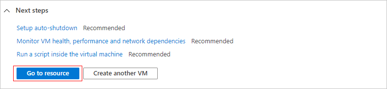

<p align="center">
  
</p>

# Azure-Project
# 💻 Início Rápido: Criar uma Máquina Virtual do Windows no Portal do Azure

**Artigo • 2025-01-31 • 27 colaboradores**

---

## Neste artigo

**Aplica-se a:** ✔️ VMs do Windows

As máquinas virtuais (VMs) do Azure podem ser criadas por meio do Portal do Azure. Este guia prático mostra como usar a interface baseada em navegador para implantar uma máquina virtual que executa o Windows Server 2022 Datacenter, conectar-se via RDP, instalar o servidor Web IIS e, ao final, limpar ou automatizar o desligamento dos recursos.

> **Importante:**
> As etapas deste início rápido são para fins educacionais e não substituem práticas de produção.

---

## 1. Entrar no Portal do Azure

1. Acesse o [Portal do Azure](https://portal.azure.com/) e faça login com sua conta Microsoft ou corporativa.
2. Se não tiver uma assinatura, crie uma [conta gratuita](https://azure.microsoft.com/free/).

---

## 2. Criar a Máquina Virtual

1. No portal, digite **"Máquinas virtuais"** na pesquisa e selecione o serviço.
2. Clique em **Criar > Máquina virtual** para abrir o formulário de criação.
3. Preencha **Detalhes da instância**:

   * **Nome da VM:** `myVM`
   * **Imagem:** Windows Server 2022 Datacenter: Azure Edition – x64 Gen 2
   
   * **Região:** escolha a mais próxima para reduzir latência
   * **Tamanho:** selecione uma SKU de teste (ex.: B1s)
4. Em **Conta de administrador**, defina:
   

   * **Nome de usuário:** `azureuser`
   * **Senha:** mínimo de 12 caracteres, complexidade padrão
5. Em **Regras de porta de entrada**, selecione **Permitir portas selecionadas** e marque **RDP (3389)** e **HTTP (80)**.
   

6. Clique em **Revisar + criar**, aguarde a validação e, em seguida, **Criar**.
  

8. Ao concluir a implantação, selecione **Ir para o recurso**.
  
---

## 3. Conectar-se à VM via RDP

1. Na visão geral da VM, clique em **Conectar > RDP**.

2. Mantenha as opções padrão (IP e porta 3389) e clique em **Baixar arquivo RDP**.
3. Abra o `.rdp`, informe as credenciais (`azureuser` e senha) e confirme o certificado se solicitado.

> **Dica para Mac/Linux:** use o cliente **Microsoft Remote Desktop** ou similar.

---

## 4. Instalar o Servidor Web (IIS)

1. Dentro da VM, abra o **PowerShell** como administrador.
2. Execute o comando:

   ```powershell
   Install-WindowsFeature -Name Web-Server -IncludeManagementTools
   ```
3. Aguarde a instalação concluir e feche a sessão RDP.

---

## 5. Exibir a Página Padrão do IIS

1. No portal, na visão geral da VM, passe o mouse sobre o **IP público** e clique em **Copiar**.
2. Cole o IP em um navegador externo; a página de boas-vindas do IIS será exibida.

---

## 6. Limpar Recursos

### 6.1 Excluir Grupo de Recursos

1. Na visão geral da VM, clique no link **Grupo de recursos**.
2. Selecione **Excluir grupo de recursos**, digite o nome para confirmação e confirme.

### 6.2 Configurar Desligamento Automático

1. Em **Operações** na página da VM, selecione **Desligamento automático**.
2. Ative, defina o horário desejado (ajuste o fuso-horário) e clique em **Salvar**.

---

## Próximas Etapas

* Você implantou uma VM Windows Server 2022 Datacenter.
* Conectou-se via RDP e liberou portas de rede.
* Instalou e testou o servidor Web IIS.

Para aprofundar, explore os [tutoriais de máquinas virtuais do Azure para Windows](https://learn.microsoft.com/pt-br/azure/virtual-machines/tutorials/).
